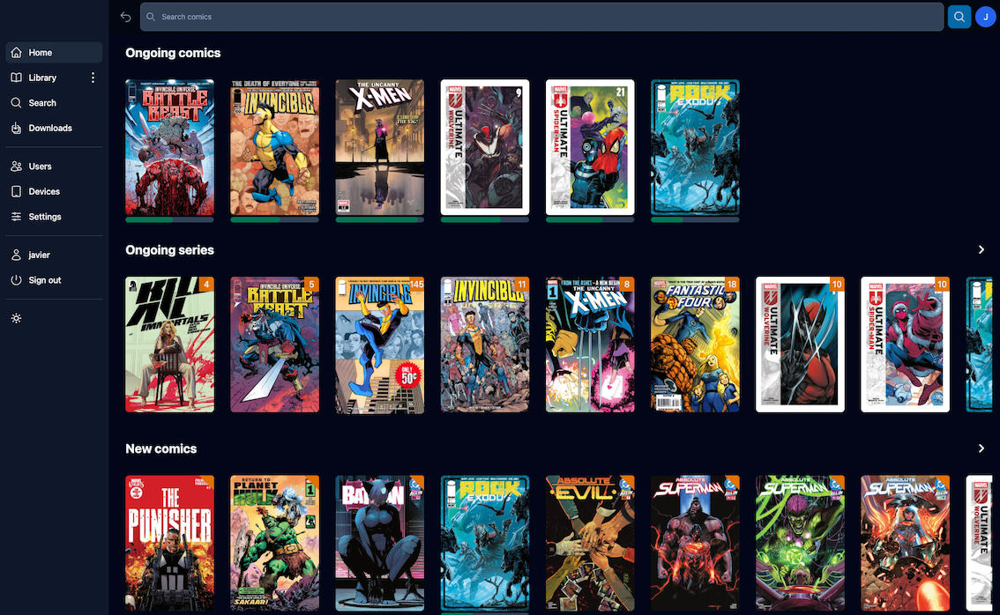

ComicVault is an open-source personal comic library and downloader.   It helps you organize, search, and manage your digital comics in a clean, modern interface.

> ⚠️ **Disclaimer:**  
> ComicVault does **not** host or distribute any comics.  
> Users are responsible for ensuring that any downloaded content is legally obtained in their jurisdiction.  

## 🧩 Features

- Modern Angular frontend and Spring Boot backend  
- User authentication and library management  
- Download management system  
- Responsive UI optimized for mobile, tablet, and desktop  
- Integration with alternative download solutions (e.g. JDownloader)  

## 🚀 Setup

Please follow the wiki for Installation and Setup:
 - [Installation guide](https://github.com/javier-ramirez-leiva/ComicVault/wiki/Installation-Guide)
 - [Settings](https://github.com/javier-ramirez-leiva/ComicVault/wiki/Settings)

 Take a look at how ComicVault manages storage to manually import comics:
  - [Storage](https://github.com/javier-ramirez-leiva/ComicVault/wiki/Storage)
